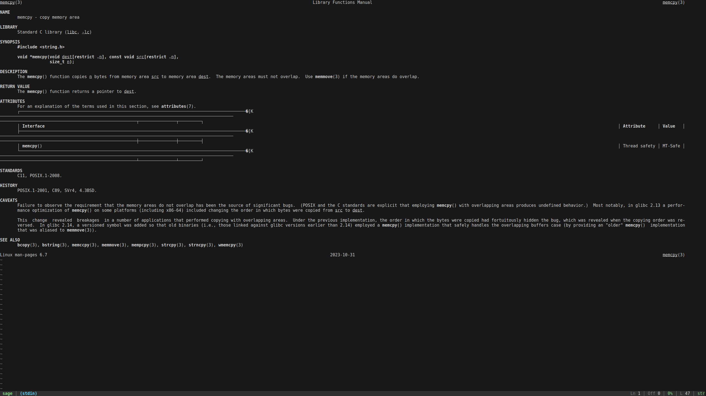

# `sage` — a fast, ergonomic terminal pager (WIP)

`sage` is a terminal pager inspired by `most`, written in Silk.



## Build

```sh
cd sage
silk build --package .
```

Binary: `./build/bin/sage`

## Man page

```sh
man -l man/sage.1
```

## Usage

```sh
./build/bin/sage <path> [path ...]  # files or directories (dirs expand to child files)
./build/bin/sage src/               # open all files in a directory (non-recursive)
cat <path> | ./build/bin/sage
./build/bin/sage --index-only <path>
./build/bin/sage --compile-cache    # compile syntax cache (see below)
./build/bin/sage --verbose --compile-cache
./build/bin/sage --verbose --list-syntax
./build/bin/sage -i <path>        # case-insensitive search
./build/bin/sage -R <path>        # regex search (std::regex)
./build/bin/sage --color never <path>
./build/bin/sage --theme ocean <path>
./build/bin/sage --no-alt-screen <path>
./build/bin/sage --no-rc <path>
```

## Keys

- `q` — quit
- `Ctrl-C` — quit (or copy selection when one is active)
- `j` / `d` / `Down` — down one visual line (wrap-to-viewport)
- `k` / `u` / `Up` — up one visual line
- `MouseWheel` — scroll (if enabled)
- `MouseDrag` — select text (gutter excluded)
- `Ctrl-C` — copy selection (OSC 52)
- `Space` / `PageDown` / `Ctrl-D` — down one page
- `b` / `PageUp` / `Ctrl-U` — up one page
- `→` / `Right` — down one page
- `←` / `Left` — up one page
- `Tab` — next tab (when multiple files are open)
- `Shift-Tab` — previous tab
- `gg` / `Home` — top
- `G` / `End` — bottom
- `/` — search (starts searching; jumps to first match when found)
- `DoubleClick` — set query to clicked word
- `n` — next match
- `p` — previous match
- `:` — command mode (`:<n>` goto line, `:q` quit, `:bn`/`:bp` next/prev tab, `:tab <n>` go to tab `<n>`; tabs are 1-indexed and `0` jumps to the last tab)
- `L` — toggle line-number gutter
- `Esc` — cancel search / cancel pending goto / clear selection
- `?` / `h` — help

## Notes

- By default, `sage` sanitizes control bytes to avoid terminal injection, but
  passes through ANSI SGR (`ESC [ ... m`) so colored output (like `man`) renders
  (use `--no-ansi` to fully sanitize).
- When stdout is not a TTY, `sage` falls back to streaming bytes to stdout.
- Line numbers are computed using a background indexer; on very large inputs they
  may briefly show `?` until the indexer scans past the current viewport.
- The status bar, prompts, and match highlighting use ANSI colors (256-color SGR).
  Use `--color never` or set `NO_COLOR=1` to disable styling.

## Syntax highlighting

`sage` can apply syntax highlighting when viewing a file path (not stdin).

- Syntax definitions live in `XDG_CONFIG_HOME/sage/syntax/` (`~/.config/sage/syntax/`).
- `sage --compile-cache` compiles them into `XDG_CACHE_HOME/sage/syntax/` (`~/.cache/sage/syntax/`).
- Supported source formats (subset): `.sublime-syntax`, `.tmLanguage`, `.tmLanguage.json`, `.cson` (Atom grammar).
  - `sage --list-syntax` prints supported syntax keys (one per line). Use `--verbose` to also show the key→cache mapping on stderr.
- Binary cache formats: `specs/sagec/2.0.md`.

## Config (`.sagerc`)

At startup, `sage` loads a config file (unless `--no-rc`):

1. `SAGERC` (explicit path), else
2. `./.sagerc`, else
3. `$HOME/.sagerc`

CLI flags always override `.sagerc`.

Format: `key = value` (comments start with `#` or `;`).

Supported keys (high level):
- `theme` = `default` | `ocean` | `light`
- `color` = `auto` | `always` | `never`
- `ansi`, `syntax`, `alt_screen`, `mouse`, `raw`, `binary`, `regex`, `ignore_case` = `true|false`
- `gutter` / `line_numbers` = `auto` | `always` | `never` | `true|false`
- `find_cmd` (`find`, `find-cmd`) = find command + args (whitespace-split; no shell quoting)
- `plugins` = `true|false`
- `plugins_dir` = absolute path to plugins dir (not `~`-expanded)
- `plugin_log_path` (`plugin_log`) = absolute path to plugin log (not `~`-expanded)
- Plugin limits: `plugin_load_timeout_ms`, `plugin_event_timeout_ms`, `plugin_mem_limit_mb`, `plugin_stack_limit_kb`
- Theme palette overrides (0–255): `status_bg`, `status_fg`, `status_dim`, `brand`, `accent`, `warn`, `err`, `mode_regex`, `match_bg`, `match_fg`
- Syntax palette overrides (0–255): `syn_comment`, `syn_string`, `syn_number`, `syn_keyword`, `syn_type`, `syn_function`, `syn_constant`, `syn_operator`, `syn_heading`, `syn_emphasis`, `syn_preproc`

See `.sagerc.example` for a starting point.

## Plugins (JavaScript / QuickJS)

At startup, `sage` loads `*.js` plugins in lexicographic order from:

- `--plugins-dir <path>` / `.sagerc` `plugins_dir = <path>` (if set and `$SAGE_PLUGINS_DIR` is not set), else
- `$SAGE_PLUGINS_DIR`, else
- `$XDG_CONFIG_HOME/sage/plugins` (usually `~/.config/sage/plugins`), else
- `$HOME/.config/sage/plugins`

Plugins run only in the interactive TUI path (stdout is a TTY). In pass-through
filter mode, `sage` returns early and does not load plugins.

Disable plugins (safe mode): `SAGE_NO_PLUGINS=1`, `--no-plugins`, or `.sagerc` `plugins = false`.

Plugin diagnostics are written to `$SAGE_PLUGIN_LOG` (if set), else
`$XDG_CACHE_HOME/sage/plugins.log`, else `$HOME/.cache/sage/plugins.log`.

For robustness, plugin execution is bounded (timeouts + memory/stack limits). If a plugin hits a timeout, `sage` disables plugins for the rest of the session.

Plugins run in an embedded QuickJS runtime and receive events via a global `sage`
object. See `examples/plugins/00-log-events.js`.
